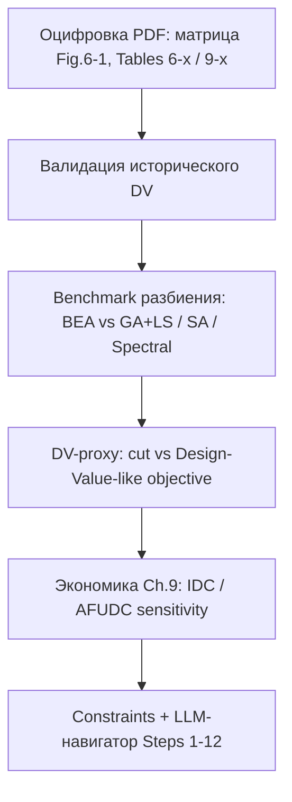
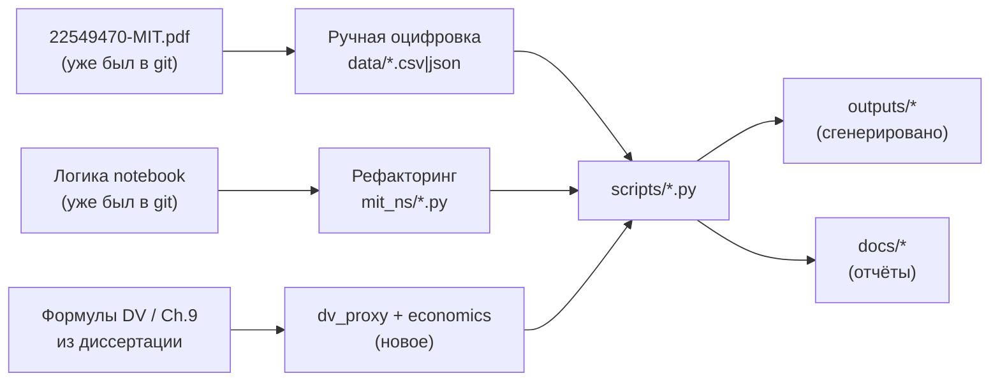

# Метрики, ход работ и словарь аббревиатур

Связанные материалы:

- отчёт о результатах: [ROSATOM_RESULTS.md](ROSATOM_RESULTS.md)
- бриф / следующие шаги: [ROSATOM_BRIEF.md](ROSATOM_BRIEF.md)
- общий runbook: [RUNBOOK.md](RUNBOOK.md)
- код метрик: [`mit_ns/objective.py`](../mit_ns/objective.py), [`mit_ns/dv_proxy.py`](../mit_ns/dv_proxy.py), [`mit_ns/economics.py`](../mit_ns/economics.py)
- назначение файлов расширения: [§12](#12-назначение-файлов-проекта-расширение-работы)
---

## 1. Ход работ (что делали и зачем)

Работы шли по слоям — от оцифровки диссертации к современным экспериментам.




| Шаг | Действие                                                                                                                                   | Зачем                                                              |
| --- | ------------------------------------------------------------------------------------------------------------------------------------------ | ------------------------------------------------------------------ |
| 1   | Оцифровать матрицу 25×25 и таблицы [DV](#abbr-dv)                                                                                          | Получить воспроизводимые входные данные                            |
| 2   | Проверить [DV](#abbr-dv) Modular [SH II](#abbr-sh-ii) ≈ $51.78M                                                                            | Убедиться, что цифры диссертации сходятся                          |
| 3   | Сравнить [BEA](#abbr-bea)-style с [GA+LS](#abbr-ga-ls) / [SA](#abbr-sa) / [Spectral](#abbr-spectral) / [Louvain](#abbr-louvain) по **cut** | Ответить: бьют ли современные методы эвристику 1989                |
| 4   | Ввести [DV](#abbr-dv)-proxy ([MOM](#abbr-mom) + суррогаты)                                                                                 | Ответить: улучшает ли оптимизация не только cut, но и Design Value |
| 5   | Воспроизвести экономику [Ch.9](#abbr-ch)                                                                                                   | Связать модульность со сроком строительства и [AFUDC](#abbr-afudc) |
| 6   | Constraints + methodology navigator                                                                                                        | Показать ИИ как сопровождение инженера, не как автодизайн АЭС      |


**Принцип интерпретации:** исторические −32% [DV](#abbr-dv) и −26…46% capital cost — результат redesign в диссертации; [GA+LS](#abbr-ga-ls) улучшает **матричный этап**, а [DV](#abbr-dv)-proxy показывает, что cut ≠ полная проектная ценность.

---


## 2. Входные параметры, общие для метрик

| Параметр | Обозначение | Откуда | Смысл |
|---|---|---|---|
| Матрица взаимодействий | `M[i,j]` | Файл [`input_matrix_figure_6_1.csv`](../input_matrix_figure_6_1.csv) — оцифровка **Fig. 6-1** диссертации (стр. ~207) | Сила/стоимость связи систем i и j |
| Число систем | `n = 25` | Список систем: [`data/system_labels.csv`](../data/system_labels.csv) (из **Table 6-2** диссертации) | Узлы графа / число строк-столбцов матрицы |
| Назначение в модули | `a[i] ∈ {0..K-1}` | Выход оптимизаторов: [`mit_ns/bea.py`](../mit_ns/bea.py), [`mit_ns/ga_ls.py`](../mit_ns/ga_ls.py), [`mit_ns/sa.py`](../mit_ns/sa.py), [`mit_ns/spectral.py`](../mit_ns/spectral.py); лучшие варианты пишутся в [`outputs/best_assignments.json`](../outputs/best_assignments.json) | Какая система в каком модуле |
| Число модулей | `K ∈ {3,4,5,6}` | Задаётся в бенчмарке: [`mit_ns/benchmark.py`](../mit_ns/benchmark.py) (`k_values`), CLI [`scripts/run_benchmark.py`](../scripts/run_benchmark.py) | Сколько модулей ищем |
| Мин. размер модуля | `min_size = 2` | Константа ограничений в [`mit_ns/objective.py`](../mit_ns/objective.py) (`is_valid_assignment`, `size_penalties`) | Не оставлять модули из 1 системы |
| Макс. размер модуля | `max_size = max(5, n//K + 3)` | Функция `default_max_size()` в [`mit_ns/objective.py`](../mit_ns/objective.py) | Не делать слишком крупные модули |
| Коэффициенты [DV](#abbr-dv) | `A1..A5` | Файл [`dv_coefficients.csv`](../dv_coefficients.csv); дублируются в [`mit_ns/__init__.py`](../mit_ns/__init__.py) (`A1_MOM`…`A5_MFV`) | Веса компонентов Design Value |


---


## 3. Метрики матричного этапа


### 3.1. [MEINT](#abbr-meint) (Matrix Element Interaction Total)

**Смысл:** суммарный объём недодиагональных связей матрицы (проверка целостности оцифровки).

```text
MEINT = ( sum(M[i,j]) - trace(M) ) / 2  =  1228
```


| Параметр  | Роль                                             |
| --------- | ------------------------------------------------ |
| `M[i,j]`  | элементы матрицы                                 |
| `trace(M)` | след матрицы: сумма главной диагонали `M[0,0]+…+M[24,24]` (здесь = 25, единицы-маркеры самосвязи) |
| `/ 2` | деление пополам, потому что матрица симметрична: каждая связь `i–j` учтена дважды (`M[i,j]` и `M[j,i]`) |
| диагональ | исключается через `− trace(M)`, чтобы не считать «связи системы с собой» |


### 3.2. Inter-module cut

**Смысл:** главная целевая функция исходного benchmark. Показывает, какой объём «дорогих» связей из матрицы остаётся **между разными модулями** (их придётся стыковать на площадке), а не внутри модулей.

В терминах теории графов: матрица — взвешенный неориентированный граф систем; assignment — раскраска вершин в K модулей; **cut** — сумма весов рёбер, у которых концы в разных модулях (мультиразрезающий разрез / multiway cut).

```text
cut(a) = sum over all pairs (i < j) where a[i] ≠ a[j]  of  M[i,j]
```

Код: [`mit_ns/objective.py`](../mit_ns/objective.py) → `inter_module_cut()`.

#### Как считается по шагам

1. Берём симметричную матрицу `M` (25×25) и вектор `a` длины 25: `a[i]` = номер модуля системы i.
2. Перебираем все неупорядоченные пары систем `(i, j)` с `i < j` (чтобы не считать связь дважды).
3. Если `a[i] == a[j]` — системы в одном модуле → связь **внутренняя**, в cut **не** входит.
4. Если `a[i] != a[j]` — связь **межмодульная** → к cut прибавляется `M[i,j]`.
5. Диагональ `M[i,i]` в сумму не попадает (пары `i < j`).

| Параметр | Роль |
|---|---|
| `M[i,j]` | вес / «стоимость» интерфейса между системами i и j (из Fig. 6-1) |
| `a[i], a[j]` | метки модулей (результат BEA / GA+LS / SA / …) |
| `i < j` | обход только верхней половины симметричной матрицы |
| K | число модулей; само по себе в формулу cut не входит, но задаёт, сколько «частей» режем |

#### Связь с MEINT и MOM

| Величина | Что суммирует |
|---|---|
| **MEINT = 1228** | *все* недодиагональные связи матрицы (полный «бюджет» интерфейсов) |
| **cut(a)** | только те из них, что оказались **между** модулями при разбиении `a` |
| **внутримодульные связи** | `MEINT − cut(a)` (неявно) |

Отсюда: `0 ≤ cut(a) ≤ MEINT`. Чем лучше сгруппированы сильно связанные системы, тем меньше cut.

В DV-proxy для нового partition берём **MOM ≈ cut** (та же размерность «суммы интерфейсных весов»). Исторический MOM Modular SH II (= 1180) — из Table 6-10 диссертации, это не обязательно cut конкретного нашего assignment.

#### Интуитивный пример

Допустим, три системы и `K = 2`:

```text
M:        1    2    3
      1 [ ·   10    1 ]
      2 [ 10   ·    2 ]
      3 [  1   2    · ]

Вариант A: модуль0={1,2}, модуль1={3}
  межмодульные рёбра: 1–3 (вес 1), 2–3 (вес 2)  →  cut = 3

Вариант B: модуль0={1,3}, модуль1={2}
  межмодульные: 1–2 (10), 2–3 (2)  →  cut = 12
```

Вариант A лучше: сильная связь 10 спрятана **внутри** модуля.

#### Интерпретация для проектирования

| Меньше cut | Больше cut |
|---|---|
| Модули более самодостаточны | Много стыков между модулями на площадке |
| Меньше межмодульного piping / интерфейсов | Выше MOM-подобная «цена» стыковки |
| Ближе к цели методологии Lapp (минимизировать inter-module requirements) | Хуже с точки зрения матричного этапа |

**Важно:** cut — это **только матричный критерий**. Он не учитывает геометрию модулей, pipe routing (PPRV), бетон (CVV), alignment (MAV). Поэтому снижение cut не равно автоматически снижению полного Design Value (см. DV-proxy).

#### Где используется в проекте

- Единая objective для сравнения [BEA](#abbr-bea)-style / [GA+LS](#abbr-ga-ls) / [SA](#abbr-sa) / [Spectral](#abbr-spectral) / [Louvain](#abbr-louvain).
- Таблица улучшений 25–35% в README / отчёте: это Improvement% по **cut**, не по $.
- В GA/SA к cut часто добавляют **size penalties** (§3.5) — это уже fitness поиска, не чистый cut.
- В constraint-aware режиме к cut добавляют mixing penalty (§3.6).

#### Типичные значения на Shearon Harris (reference)

| K | BEA-style cut | GA+LS best cut | Смысл |
|---:|---:|---:|---|
| 3 | 79 | 51 | из 1228 «бюджета» MEINT наружу уходит мало |
| 4 | 188 | 134 | больше модулей → обычно выше cut |
| 5 | 268 | 201 | то же |
| 6 | 356 | 250 | то же |

Тренд «больше K → больше cut» ожидаем: при большем числе границ больше рёбер оказывается межмодульными. Оптимизатор ищет **лучшее** разбиение при фиксированном K, а не «правильное» K.

### 3.3. Improvement vs [BEA](#abbr-bea)

**Смысл:** на сколько процентов современный метод снизил inter-module cut относительно BEA-style baseline **при том же K** и тех же ограничениях размера модулей.

```text
Improvement% = 100 * (cut_BEA - cut_method) / cut_BEA
```

#### Параметры формулы

| Параметр | Откуда берётся | Роль |
|---|---|---|
| `cut_BEA` | один детерминированный прогон `bea_partition()` | baseline «как идея BEA 1989» |
| `cut_method` | обычно **best** cut метода (GA+LS / SA / …) по N запускам | результат, с которым сравниваем |
| `K` | фиксируется одинаковым для обеих сторон | сравнение только внутри одного числа модулей |

В отчётах `cut_method` почти всегда = **best** GA+LS (не mean): интересует достижимый лучший разрез, а не среднее по случайным seed.

#### Как читать знак и величину

| Improvement% | Интерпретация |
|---|---|
| **> 0** | метод лучше BEA: меньше межмодульных связей |
| **= 0** | тот же cut, что у BEA |
| **< 0** | метод хуже BEA (типично для Spectral/Louvain на этой матрице) |

Пример для K=3 из reference-прогона:

```text
cut_BEA = 79
cut_GA+LS = 51
Improvement% = 100 * (79 - 51) / 79 ≈ 35.4%
```

То есть GA+LS «срезал» около трети межмодульного разреза BEA.

#### Reference-таблица (30 runs, notebook)

| K | cut_BEA | cut_GA+LS (best) | Improvement% |
|---:|---:|---:|---:|
| 3 | 79 | 51 | **35.4%** |
| 4 | 188 | 134 | **28.7%** |
| 5 | 268 | 201 | **25.0%** |
| 6 | 356 | 250 | **29.8%** |

Итоговый коридор в README/отчёте (**~25–35%**) — это min…max по этим четырём K.

#### Условия честного сравнения

Чтобы Improvement% был осмысленным, у BEA и метода должны совпадать:

1. одна и та же матрица `M`;
2. одно и то же **K**;
3. одни и те же `min_size` / `max_size`;
4. одна и та же метрика — **чистый cut** (без size/mixing penalties в самом числе cut; штрафы влияют только на поиск, а в таблицу пишется пересчитанный `inter_module_cut`).

Сравнивать Improvement% при K=3 с K=6 напрямую нельзя: у них разный «базовый» cut_BEA и разная сложность задачи.

#### Чего Improvement% **не** означает

| Не путать с | Почему |
|---|---|
| Снижением Design Value (−32.3%) | это исторический redesign SH II в диссертации, не GA+LS |
| Снижением capital cost (26–46%) | экономика Ch.9, другой блок |
| Улучшением DV-proxy | считается отдельно; cut↓ не гарантирует DV_proxy↓ |
| «Метод спроектировал АЭС лучше MIT» | улучшен только матричный этап разбиения |

#### Где считается / где смотреть

- Формула применяется при анализе `outputs/benchmark_results.csv` (колонка `best` для `BEA-style` и `GA+LS`).
- CLI после прогона печатает Improvement в `scripts/run_benchmark.py`.
- В дашборде — панель «GA+LS improvement vs BEA (%)».

### 3.4. Best / Mean / Std по запускам

Для стохастических методов ([GA+LS](#abbr-ga-ls), [SA](#abbr-sa), [Spectral](#abbr-spectral), [Louvain](#abbr-louvain)) при N независимых seed:


| Метрика  | Как считается                  |
| -------- | ------------------------------ |
| **best** | минимальный cut среди запусков |
| **mean** | среднее cut                    |
| **std**  | стандартное отклонение cut     |


[BEA](#abbr-bea)-style детерминирован → один прогон.

### 3.5. Штрафы размера модуля (fitness, не «качество дизайна»)

В GA/SA к целевой функции добавляются штрафы:


| Нарушение           | Штраф                       |
| ------------------- | --------------------------- |
| число модулей ≠ K   | `10000 * abs(#modules - K)` |
| размер > `max_size` | `5000 * (size - max_size)`  |
| размер < 2          | `5000 * (2 - size)`         |


Это **ограничения поиска**, а не метрики диссертации.

### 3.6. Mixing penalty (constraint-aware)

**Смысл:** штраф, если в одном модуле смешаны primary nuclear-related и secondary energy systems (правила из [Ch.5](#abbr-ch)–6).

Параметры: группы систем из `data/design_constraints.json`, `penalty_per_mixed_edge`.

---


## 4. Метрики Design Value (диссертация)


### 4.1. Итоговая формула [DV](#abbr-dv)

```text
DV = A1·MOM + A2·MAV + A3·PPRV + A4·CVV + A5·MFV
```


| Коэффициент | Значение | Компонент          |
| ----------- | -------- | ------------------ |
| A1          | 535      | [MOM](#abbr-mom)   |
| A2          | 472      | [MAV](#abbr-mav)   |
| A3          | 1268     | [PPRV](#abbr-pprv) |
| A4          | 36       | [CVV](#abbr-cvv)   |
| A5          | 196      | [MFV](#abbr-mfv)   |


Коэффициенты калиброваны в диссертации так, чтобы численные «design quantities» отражали относительный вклад в стоимость.

### 4.2. [MOM](#abbr-mom) — Measure of Modularity

**Смысл:** мера межмодульных интерфейсов / сложности стыковки модулей на площадке.

**В диссертации:** сумма [MBIV](#abbr-mbiv) (Module Boundary Interface Values) по системам (Table 6-10).

**В нашем cut-benchmark / [DV](#abbr-dv)-proxy:** для нового partition

```text
MOM(a) ≈ cut(a)
```

(та же размерность «суммы интерфейсных весов» из матрицы).


| Исторические значения        | [MOM](#abbr-mom) |
| ---------------------------- | ---------------- |
| Original [SH](#abbr-sh)      | 2112             |
| Modular [SH II](#abbr-sh-ii) | 1180             |


### 4.3. [MAV](#abbr-mav) — Module Alignment Value

**Смысл:** насколько сложно выравнивать и стыковать модули по вертикали/горизонтали на площадке.

**В диссертации:**

```text
MAV = 4 * MVAV + MHAV
```


| Часть                  | Смысл                                                                |
| ---------------------- | -------------------------------------------------------------------- |
| **[MVAV](#abbr-mvav)** | Module Vertical Alignment Value (опоры, крыша, aligned / misaligned) |
| **[MHAV](#abbr-mhav)** | Module Horizontal Alignment Value                                    |
| множитель 4            | больший вес вертикальных работ относительно горизонтальных           |


Для [SH II](#abbr-sh-ii): `MVAV=672`, `MHAV=207` → `MAV=2895`.

### 4.4. [PPRV](#abbr-pprv) — Pipe Penalty Routing Value

**Смысл:** штраф за сложность piping: длина, отводы (bends), смены уровня, пересечения (crossovers).

**В диссертации:** system-by-system анализ трасс.

**У нас для исторического [DV](#abbr-dv):** фиксированное значение [SH II](#abbr-sh-ii) = **2773** (без пересчёта трасс — данных нет).

### 4.5. [CVV](#abbr-cvv) — Concrete Volume Value

**Смысл:** объём/стоимость бетонных конструкций (стены, плиты, формы, арматура и т.д.).

**В диссертации:** Table 6-12. В проекте используется **calculated_result** Case 2 (= 1 266 483), а не расходящийся printed_result.

### 4.6. [MFV](#abbr-mfv) — Modular Function Value

**Смысл:** функция от числа геометрических стилей модулей и числа модулей каждого стиля (унификация / повторяемость).

**В диссертации:** Table 6-13 → [SH II](#abbr-sh-ii) = **3444**.

### 4.7. Исторический итог [DV](#abbr-dv)


| Вариант                      | [DV](#abbr-dv) | Источник                        |
| ---------------------------- | -------------- | ------------------------------- |
| Original Plant               | **$76.45M**    | headline + пересчёт Table 9-1   |
| Modular [SH II](#abbr-sh-ii) | **$51.78M**    | Tables 6-10…6-13 + коэффициенты |
| Снижение                     | **32.3%**      | `(76.45 - 51.78) / 76.45`       |


---


## 5. Метрики [DV](#abbr-dv)-proxy (суррогаты для новых partition)

### 5.1. Зачем нужен DV-proxy

Исторический Design Value из §4 считается по **готовым таблицам** Modular SH II (конкретный экспертный redesign).  
Оптимизатор же выдаёт **новое** разбиение `a` (assignment модулей). Для него в открытой диссертации **нет**:

- геометрии опор / уровней → нельзя пересчитать настоящий [MAV](#abbr-mav);
- трасс труб (длина, bends, elevations, crossovers) → нельзя пересчитать настоящий [PPRV](#abbr-pprv);
- объёмов бетона по новому layout → нельзя пересчитать настоящий [CVV](#abbr-cvv);
- каталога геометрических стилей модулей → нельзя пересчитать настоящий [MFV](#abbr-mfv).

Из матрицы напрямую для любого `a` считается только **cut ≈ MOM**.

**DV-proxy** — Design-Value-подобная скалярная метрика, которую можно считать для **любого** partition и подавать в GA как objective. Это не «настоящий DV Lapp», а **суррогат**, чтобы ответить на вопрос:

> улучшает ли современный оптимизатор не только cut, но и что-то ближе к полной проектной ценности?

Код: [`mit_ns/dv_proxy.py`](../mit_ns/dv_proxy.py) · прогон: `python scripts/run_dv_proxy.py`.

### 5.2. Общая формула

Те же коэффициенты A1…A5, что в диссертации:

```text
DV_proxy = 535·MOM + 472·MAV̂ + 1268·PPRV̂ + 36·CVV̂ + 196·MFV̂
```

| Часть | Источник |
|---|---|
| Коэффициенты 535, 472, 1268, 36, 196 | [`dv_coefficients.csv`](../dv_coefficients.csv) |
| [MOM](#abbr-mom) | = `cut(a)` из матрицы |
| MAV̂, CVV̂, MFV̂, PPRV̂ | суррогаты от размеров модулей / cut (ниже) |

Базовые якоря — исторические значения Modular [SH II](#abbr-sh-ii) (чтобы суррогаты были в том же масштабе):

| Якорь | Значение | Откуда |
|---|---:|---|
| `MAV0` | 2895 | Table 6-11 / Table 9-1 |
| `CVV0` | 1 266 483 | Table 6-12 calculated Case 2 |
| `MFV0` | 3444 | Table 6-13 |
| `PPRV0` | 2773 | Table 9-1 / Ch.6 |
| `MOM_ref` | 1180 | исторический MOM SH II (масштаб для PPRV̂) |

### 5.3. Входы суррогатов (из assignment)

Пусть разбиение дало размеры модулей `s1, s2, …, sK` (сколько систем в каждом модуле).

| Обозначение | Как получить | Смысл |
|---|---|---|
| `K` | число модулей | сколько «кусков» |
| `s̄` | среднее `si` | типичный размер модуля |
| `CV = std(s) / s̄` | коэффициент вариации размеров | насколько модули «неровные» |
| `n_styles` | число **уникальных** значений среди `si` | сколько разных «типоразмеров» |
| `cut(a)` | inter-module cut | объём межмодульных связей |

Пример: `a` дал размеры `(8, 8, 9)` при K=3 → `s̄≈8.33`, `CV` маленький, `n_styles=2`.

### 5.4. Суррогаты по компонентам

| Компонент | Формула | Интуиция | Что растёт / падает |
|---|---|---|---|
| **MOM** | `cut(a)` | единственный «честный» член из матрицы | ↑ cut → ↑ MOM |
| **MAV̂** | `MAV0*(0.85 + 0.5*CV) + 40*abs(K-5)` | ровные модули проще стыковать/выравнивать; K около 5 ближе к «середине» диапазона эксперимента | ↑ дисбаланс размеров или \|K−5\| → ↑ MAV̂ |
| **CVV̂** | `CVV0*(0.92 + 0.03*K + 0.15*CV)` | больше модулей / кривые размеры → больше границ, форм, «бетонной» сложности | ↑ K или CV → ↑ CVV̂ |
| **MFV̂** | `MFV0*(0.7 + 0.08*K + 0.15*n_styles)` | унификация: много разных размеров модулей хуже, чем повторяемые типоразмеры | ↑ K или n_styles → ↑ MFV̂ |
| **PPRV̂** | `PPRV0*(0.5 + 0.5*cut/MOM_ref)` | больше межмодульных интерфейсов → условно больше «плохой» обвязки | ↑ cut → ↑ PPRV̂ |

Опция `freeze_pprv=True` в коде фиксирует PPRV̂ = 2773 (исторический), если нужно отключить зависимость PPRV от cut.

### 5.5. Почему доминирует CVV (важно для интерпретации)

Вклад членов в DV масштабируется коэффициентами × величинами:

| Член | Примерный порядок |
|---|---|
| `A1·MOM` | 535 × (десятки…сотни) → ~10⁴…10⁵ |
| `A2·MAV̂` | 472 × ~3000 → ~10⁶ |
| `A3·PPRV̂` | 1268 × ~2000 → ~10⁶ |
| `A4·CVV̂` | 36 × ~1.3·10⁶ → **~4.5·10⁷** |
| `A5·MFV̂` | 196 × ~4000 → ~10⁶ |

**`A4·CVV̂` на порядки больше остальных.** Поэтому GA, минимизирующий `DV_proxy`, охотно жертвует cut (и MOM/PPRV̂), если чуть снизит CVV̂ за счёт более ровных / «удобных» размеров модулей. Это ожидаемое поведение формулы, а не баг оптимизатора.

### 5.6. Три режима эксперимента

`scripts/run_dv_proxy.py` для каждого K сравнивает:

| Режим (`mode`) | Что оптимизирует | Зачем |
|---|---|---|
| **BEA-style** | greedy BEA + границы (не DV) | baseline разбиения |
| **cut_only** | GA+LS по `cut` | «классический» benchmark |
| **dv_proxy** | GA+LS по `DV_proxy` | проверка, меняется ли картина |

Результаты: [`outputs/dv_proxy_results.csv`](../outputs/dv_proxy_results.csv).

### 5.7. Что показал прогон (reference)

Пример для **K=3** (из `dv_proxy_results.csv`):

| mode | cut | DV_proxy |
|---|---:|---:|
| BEA-style | 79 | ~$53.41M |
| cut_only | 55 | ~$53.36M |
| **dv_proxy** | **164** | **~$50.60M** |

Выводы:

1. **cut_only ≈ BEA по DV_proxy** (разница доли процента): сильное улучшение cut почти не двигает прокси-стоимость — CVV̂ почти не меняется.
2. **dv_proxy-режим** снижает DV_proxy (~$50.6M vs ~$53.4M), но **cut растёт** (164 vs 55): оптимизатор «разменивает» матричный разрез на более выгодный (для суррогата) баланс размеров модулей.
3. Аналогичная картина на K=4…6: dv_proxy лучше по DV_proxy, хуже по cut.

Это главный методологический результат расширения: **минимизация cut ≠ минимизация Design-Value-подобной метрики**.

### 5.8. Чего DV-proxy не делает

| Не делает | Почему |
|---|---|
| Не равен историческому DV SH II ($51.78M) | другие компоненты (суррогаты vs Tables 6-x) |
| Не доказывает экономию капитала 26–46% | это Ch.9, другая модель |
| Не заменяет pipe/layout расчёт | суррогаты эвристические |
| Не калиброван на реальных данных Росатома | якоря — Shearon Harris II из диссертации |

### 5.9. Как воспроизвести и куда смотреть

```bash
python scripts/run_dv_proxy.py --quick          # smoke
python scripts/run_dv_proxy.py --runs 10        # стабильнее best
```

| Артефакт | Содержание |
|---|---|
| `outputs/dv_proxy_results.csv` | mode, K, mom/mav/pprv/cvv/mfv, cut, dv |
| Панель дашборда «DV-proxy ($M)» | визуальное сравнение режимов |

---


## 6. Экономические метрики (Chapter 9)


### 6.1. Базовая капитальная стоимость C

Из Tables 9-8a,b (фрагмент RAB/CB + piping + facilities + equipment):


| Кейс                                                             | Conventional C | Modular C |
| ---------------------------------------------------------------- | -------------- | --------- |
| Case 1 ([SH](#abbr-sh) vs [SH II](#abbr-sh-ii) modular)          | $197.2M        | $135.7M   |
| Case 2 ([SH II](#abbr-sh-ii) conv. vs [SH II](#abbr-sh-ii) mod.) | $143.6M        | $135.7M   |


### 6.2. Total with [IDC](#abbr-idc) / [AFUDC](#abbr-afudc)-прокси

Равномерное расходование средств за срок строительства T при ставке r:

```text
Total = C * ((1 + r)^T - 1) / (r * T)
```


| Параметр | Значения в сетке                                        |
| -------- | ------------------------------------------------------- |
| `T_conv` | 5 или 7 лет                                             |
| `r`      | 6%, 10%, 14%                                            |
| `T_mod`  | `0.50 / 0.65 / 0.80 * T_conv` (Cases A/B/C диссертации) |


### 6.3. Savings

```text
savings_USD = Total_conv - Total_mod          (в млн USD)
savings_pct = 100 * (Total_conv - Total_mod) / Total_conv
```

**Тезисные средние ([Ch.9.6.3](#abbr-ch)):** Case 1 @ 7y ≈ **46%**, Case 2 @ 7y ≈ **26%** → abstract band **26–46%**.

---


## 7. Сводка: какая метрика на какой вопрос отвечает


| Вопрос                                                      | Метрика                             | Тип                        |
| ----------------------------------------------------------- | ----------------------------------- | -------------------------- |
| Цела ли оцифровка матрицы?                                  | [MEINT](#abbr-meint) = 1228         | проверка данных            |
| Хорошо ли сгруппированы системы?                            | inter-module cut / [MOM](#abbr-mom) | оптимизация                |
| Насколько хорош исторический redesign [SH II](#abbr-sh-ii)? | [DV](#abbr-dv) из таблиц            | валидация диссертации      |
| Улучшает ли [GA](#abbr-ga) Design Value, а не только cut?   | `DV_proxy`                          | расширение эксперимента    |
| Есть ли экономия от модульности + сжатия срока?             | savings% ([IDC](#abbr-idc))         | экономика [Ch.9](#abbr-ch) |
| Соблюдаются ли nuclear/secondary правила?                   | mixing penalty                      | constraints                |


---


## 8. Словарь аббревиатур

Клик по аббревиатуре в тексте документа ведёт к строке в этом словаре (якорные ссылки `#abbr-...`). В словаре ниже аббревиатуры — якоря назначения.

### 8.1. Метрики и методология диссертации


| Аббревиатура | Расшифровка (EN)                                      | По-русски                                                   |
| ------------ | ----------------------------------------------------- | ----------------------------------------------------------- |
| **DV**       | Design Value                                          | Интегральная «ценность/стоимость» модульного дизайна        |
| **MOM**      | Measure of Modularity                                 | Мера модульности (межмодульные интерфейсы)                  |
| **MBIV**     | Module Boundary Interface Value                       | Вклад интерфейсов на границе модуля                         |
| **MAV**      | Module Alignment Value                                | Сложность выравнивания модулей                              |
| **MVAV**     | Module Vertical Alignment Value                       | Вертикальная составляющая MAV                               |
| **MHAV**     | Module Horizontal Alignment Value                     | Горизонтальная составляющая MAV                             |
| **PPRV**     | Pipe Penalty Routing Value                            | Штраф за маршрутизацию трубопроводов                        |
| **CVV**      | Concrete Volume Value                                 | Показатель бетонного объёма/стоимости                       |
| **MFV**      | Modular Function Value                                | Функция унификации геометрий модулей                        |
| **MEINT**    | Matrix Element Interaction Total                      | Суммарный объём взаимодействий в матрице                    |
| **BEA**      | Bond Energy Algorithm                                 | Алгоритм «энергии связей» для переупорядочивания матрицы    |
| **PWBS**     | Product Work Breakdown Structure                      | Иерархия работ/изделий (shipbuilding / Group Technology)    |
| **AFUDC**    | Allowance for Funds Used During Construction          | Проценты на капитал в период строительства                  |
| **IDC**      | Interest During Construction                          | Модель процентов за период строительства (наш прокси AFUDC) |
| **DSM**      | Design Structure Matrix / Dependency Structure Matrix | Матрица зависимостей / взаимодействий                       |
| **QA/QC**    | Quality Assurance / Quality Control                   | Обеспечение и контроль качества                             |


### 8.2. Алгоритмы и ИИ в проекте


| Аббревиатура | Расшифровка                             | Смысл в проекте                                           |
| ------------ | --------------------------------------- | --------------------------------------------------------- |
| **GA**       | Genetic Algorithm                       | Генетический алгоритм                                     |
| **LS**       | Local Search                            | Локальный поиск (улучшение индивида)                      |
| **GA+LS**    | Genetic Algorithm + Local Search        | Основной современный оптимизатор                          |
| **SA**       | Simulated Annealing                     | Имитация отжига                                           |
| **Spectral** | Spectral Clustering                     | Спектральная кластеризация (sklearn)                      |
| **Louvain**  | Louvain / greedy modularity communities | Community detection baseline                              |
| **LLM**      | Large Language Model                    | Большая языковая модель (навигатор / extract)             |
| **OCR**      | Optical Character Recognition           | Распознавание текста (в связке с extract PDF)             |
| **ML**       | Machine Learning                        | Машинное обучение (graph baselines)                       |
| **GNN**      | Graph Neural Network                    | Графовая нейросеть (в roadmap; в коде — Louvain/Spectral) |


### 8.3. Объект и здания станции


| Аббревиатура   | Расшифровка                              | Смысл                                                      |
| -------------- | ---------------------------------------- | ---------------------------------------------------------- |
| **MIT**        | Massachusetts Institute of Technology    | Источник диссертации                                       |
| **SH / SHNPP** | Shearon Harris (Nuclear Power Plant)     | Исходная АЭС-кейс                                          |
| **SH II**      | Shearon Harris Plant II                  | Модульный redesign в диссертации                           |
| **PWR**        | Pressurized Water Reactor                | Водо-водяной реактор под давлением                         |
| **BWR**        | Boiling Water Reactor                    | Кипящий реактор (упоминается в методологии)                |
| **HTGR**       | High-Temperature Gas-cooled Reactor      | Высокотемпературный газоохлаждаемый (в общем списке типов) |
| **NPP**        | Nuclear Power Plant                      | АЭС                                                        |
| **RB**         | Reactor Building                         | Здание реактора                                            |
| **RAB**        | Reactor Auxiliary Building               | Реакторное вспомогательное здание                          |
| **CB**         | Control Building                         | Здание управления                                          |
| **FHB**        | Fuel Handling Building                   | Здание обращения с топливом                                |
| **WPB**        | Waste Process Building                   | Здание переработки отходов                                 |
| **TB**         | Turbine Building                         | Турбинное отделение                                        |
| **FSAR**       | Final Safety Analysis Report             | Отчёт по безопасности (источник flow diagrams)             |
| **NNS**        | Non-Nuclear Safety                       | Неядерный класс безопасности piping                        |
| **ASME**       | American Society of Mechanical Engineers | Классы/коды трубопроводов и оборудования                   |
| **EPRI**       | Electric Power Research Institute        | Упоминается в связанных требованиях ALWR                   |
| **ALWR**       | Advanced Light Water Reactor             | Перспективный легководный реактор                          |


### 8.4. Системы станции (матрица 25×25, Table 6-2)


| ID  | Аббр.         | Полное название                       |
| --- | ------------- | ------------------------------------- |
| 1   | **RCS**       | Reactor Coolant System                |
| 2   | **SIS**       | Safety Injection System               |
| 3   | **RHR**       | Residual Heat Removal                 |
| 4   | **CS**        | Containment Spray System              |
| 5   | **CVCS**      | Chemical and Volume Control System    |
| 6   | **BTRS**      | Boron Thermal Regeneration System     |
| 7   | **BRS**       | Boron Recycle System                  |
| 8   | **CCW**       | Component Cooling Water               |
| 9   | **ESW**       | Emergency Service Water               |
| 10  | **AFW**       | Auxiliary Feedwater                   |
| 11  | **FP&C**      | Fuel Pool Cooling & Cleaning          |
| 12  | **MS**        | Main Steam                            |
| 13  | **SD**        | Steam Dump System                     |
| 14  | **AS**        | Auxiliary Steam                       |
| 15  | **FW**        | Feedwater System                      |
| 16  | **COND**      | Condensate System                     |
| 17  | **FWHV&D**    | Feedwater Heater Vents & Drains       |
| 18  | **SGBD**      | Steam Generator Blowdown              |
| 19  | **MT**        | Main Turbine                          |
| 20  | **GSSS**      | Gland Seal Steam System               |
| 21  | **NSW**       | Normal Service Water                  |
| 22  | **DMRWMU**    | Demineralized & Reactor Water Make-up |
| 23  | **WPS**       | Waste Process System                  |
| 24  | **CONDENSER** | Condenser Systems                     |
| 25  | **ES**        | Extraction Steam                      |


### 8.5. Прочее в репозитории / отчётах


| Аббревиатура         | Смысл                                                                                   |
| -------------------- | --------------------------------------------------------------------------------------- |
| **CAD / BIM**        | Computer-Aided Design / Building Information Modeling — 3D-проектные модели (вне scope) |
| **P&ID**             | Piping and Instrumentation Diagram — схемы трубопроводов и КИПиА                        |
| **CLI**              | Command-Line Interface — скрипты в `scripts/`                                           |
| **CSV / JSON / PNG** | форматы данных и артефактов в `data/`, `outputs/`                                       |
| **Ch.**              | Chapter — глава диссертации                                                             |
| **Fig. / Table**     | Figure / Table — рисунок / таблица диссертации                                          |


---


## 9. Где смотреть в коде и данных


| Тема                                   | Файлы                                                           |
| -------------------------------------- | --------------------------------------------------------------- |
| Cut / validity / penalties             | `mit_ns/objective.py`                                           |
| [DV](#abbr-dv)-proxy суррогаты         | `mit_ns/dv_proxy.py`                                            |
| Коэффициенты `A1..A5`                  | `dv_coefficients.csv`, `mit_ns/__init__.py`                     |
| Исторические компоненты [DV](#abbr-dv) | `data/table_9_1_dv_comparison.csv`, `table_6_10…13_*.csv`       |
| Экономика                              | `mit_ns/economics.py`, `data/capital_costs_ch9.csv`             |
| Constraints / systems                  | `data/design_constraints.json`, `data/system_labels.csv`        |
| Численные результаты                   | `outputs/benchmark_results.csv`, `outputs/dv_proxy_results.csv` |


---


## 10. Честные ограничения метрик

1. **[BEA](#abbr-bea)-style** — приближение идеи Bond Energy Algorithm, не бит-в-бит код 1989.
2. **[PPRV](#abbr-pprv) / [MAV](#abbr-mav) / [CVV](#abbr-cvv) / [MFV](#abbr-mfv)** для новых partition — **суррогаты**, пока нет pipe/layout данных.
3. Исторические [DV](#abbr-dv) и 26–46% savings **не являются** выходом [GA+LS](#abbr-ga-ls).
4. Cut и `DV_proxy` отвечают на **разные** вопросы; их нельзя смешивать в одной фразе без оговорки.

---


## 11. Происхождение файлов, созданных в рамках этой работы

Ниже — только артефакты, **добавленные при расширении воспроизведения** (пакет `mit_ns/`, `data/`, `scripts/`, `docs/`, `outputs/`, инфраструктура).  
Файлы из начального коммита репозитория (**не описываются**): `22549470-MIT.pdf`, `MIT_Nuclear_Benchmark_v7.ipynb`, исходный `README.md`, `input_matrix_figure_6_1.csv`, `dv_coefficients.csv`, `table_6_10…13_*.csv`.

Источник диссертации везде один: **Lapp, C.W. (1989), [MIT](#abbr-mit) PhD**.

### 11.1. Оцифрованные данные (`data/`)


| Файл                                | Происхождение / источник                                                                                                          | Как получен                                                                    |
| ----------------------------------- | --------------------------------------------------------------------------------------------------------------------------------- | ------------------------------------------------------------------------------ |
| `data/table_9_1_dv_comparison.csv`  | Диссертация, **Table 9-1** (сравнение компонентов [DV](#abbr-dv): Original [SH](#abbr-sh) vs Modular [SH II](#abbr-sh-ii))        | Ручная оцифровка чисел из PDF (MOM/MAV/PPRV/CVV/MFV и %)                       |
| `data/table_9_2_cost_estimates.csv` | Диссертация, **Table 9-2** (стоимостные оценки MOM/PPRV/CVV)                                                                      | Ручная оцифровка из [Ch.9.3.2](#abbr-ch)                                       |
| `data/capital_costs_ch9.csv`        | Диссертация, **Tables 9-8a,b** (итоговые capital costs Case 1/2)                                                                  | Ручная оцифровка итоговых сумм $197.2M / $135.7M / $143.6M                     |
| `data/thesis_savings_ranges.csv`    | Диссертация, **[Ch.9.6.3](#abbr-ch)** (текстовые диапазоны и средние savings)                                                     | Ручная оцифровка min/max/avg % и млн USD из обсуждения Case 1/2                |
| `data/system_labels.csv`            | Диссертация, **Table 6-2** (+ кластеры **Table 6-3**, здания **Table 6-1**)                                                       | Оцифровка 25 систем; теги safety/building_hint — из [Ch.6.2.4](#abbr-ch)–6.2.5 |
| `data/design_constraints.json`      | Диссертация, **[Ch.5](#abbr-ch) Steps 1–4**, **[Ch.6.2.4](#abbr-ch)–6.2.5** (nuclear/non-nuclear, safety regions, cluster blocks) | Структурирование правил в JSON для constraint-aware оптимизации                |


### 11.2. Библиотека Python (`mit_ns/`)


| Файл                    | Происхождение                                                             | Как получен                                                                                                       |
| ----------------------- | ------------------------------------------------------------------------- | ----------------------------------------------------------------------------------------------------------------- |
| `mit_ns/__init__.py`    | Константы `A1..A5`, исторические SH/[SH II](#abbr-sh-ii) компоненты, пути | Вынесены из notebook + Table 9-1 / Tables 6-x                                                                     |
| `mit_ns/data.py`        | Загрузка CSV/JSON                                                         | Обёртка над оцифрованными данными                                                                                 |
| `mit_ns/objective.py`   | Cut / validity / size penalties                                           | Рефакторинг логики из `MIT_Nuclear_Benchmark_v7.ipynb`                                                            |
| `mit_ns/bea.py`         | [BEA](#abbr-bea)-style bond energy + partition                            | Рефакторинг notebook (идея [BEA](#abbr-bea) — [Ch.2](#abbr-ch) диссертации)                                       |
| `mit_ns/ga_ls.py`       | [GA+LS](#abbr-ga-ls)                                                      | Рефакторинг notebook (DEAP + local search)                                                                        |
| `mit_ns/sa.py`          | Simulated annealing                                                       | Рефакторинг notebook                                                                                              |
| `mit_ns/spectral.py`    | [Spectral](#abbr-spectral) + [Louvain](#abbr-louvain) baselines           | [Spectral](#abbr-spectral) из notebook; [Louvain](#abbr-louvain) — добавленный ML/community baseline              |
| `mit_ns/dv_proxy.py`    | [DV](#abbr-dv)-proxy суррогаты                                            | **Новая конструкция**: формула [DV](#abbr-dv) из диссертации + эвристики размеров модулей (нет pipe/layout в PDF) |
| `mit_ns/economics.py`   | IDC/AFUDC sensitivity                                                     | Модель по [Ch.9.6](#abbr-ch) + оцифрованные capital costs / ranges                                                |
| `mit_ns/constraints.py` | Mixing penalties                                                          | Реализация правил из `design_constraints.json`                                                                    |
| `mit_ns/methodology.py` | Steps 1–12 navigator                                                      | Структурирование **[Ch.5.2](#abbr-ch)** (Design List)                                                             |
| `mit_ns/pdf_extract.py` | Extract известных таблиц                                                  | `pdftotext` по страницам PDF + опциональный [LLM](#abbr-llm)                                                      |
| `mit_ns/validation.py`  | Проверки [MEINT](#abbr-meint) / исторический [DV](#abbr-dv)               | Автоматизация assertions из notebook + Table 9-1                                                                  |
| `mit_ns/benchmark.py`   | Оркестрация cut / [DV](#abbr-dv)-proxy прогонов                           | Вынесение benchmark-цикла из notebook + новый [DV](#abbr-dv)-proxy режим                                          |


### 11.3. Скрипты (`scripts/`)


| Файл                               | Происхождение                                     | Назначение                                        |
| ---------------------------------- | ------------------------------------------------- | ------------------------------------------------- |
| `scripts/run_benchmark.py`         | [CLI](#abbr-cli) над `mit_ns.benchmark`           | Воспроизводимый cut-benchmark → `outputs/`        |
| `scripts/run_dv_proxy.py`          | [CLI](#abbr-cli) над [DV](#abbr-dv)-proxy режимом | Сравнение cut-only vs [DV](#abbr-dv)-proxy        |
| `scripts/run_economics.py`         | [CLI](#abbr-cli) над `mit_ns.economics`           | Сетка savings + сверка с thesis ranges            |
| `scripts/run_constraints_demo.py`  | [CLI](#abbr-cli) над `mit_ns.constraints`         | Демо nuclear/secondary penalties                  |
| `scripts/methodology_navigator.py` | [CLI](#abbr-cli) над `mit_ns.methodology`         | Steps 1–12 + export [LLM](#abbr-llm) context pack |
| `scripts/extract_pdf_tables.py`    | [CLI](#abbr-cli) над `mit_ns.pdf_extract`         | Извлечение Table 9-1/9-2/6-2 из PDF               |
| `scripts/make_dashboard.py`        | Matplotlib по `outputs/*.csv`                     | Сборка `dashboard_benchmark.png`                  |


### 11.4. Документация и инфраструктура


| Файл                           | Происхождение                                               |
| ------------------------------ | ----------------------------------------------------------- |
| `docs/ROSATOM_BRIEF.md`        | Авторский бриф для заказчика (следующие шаги / ограничения) |
| `docs/ROSATOM_RESULTS.md`      | Авторский отчёт о результатах воспроизведения               |
| `docs/METRICS_AND_GLOSSARY.md` | Этот файл: метрики, ход работ, аббревиатуры, provenance     |
| `requirements.txt`             | Зафиксированные Python-зависимости эксперимента             |
| `.gitignore`                   | Игнор venv / кэшей / `.mplconfig`                           |


> `README.md` и `MIT_Nuclear_Benchmark_v7.ipynb` **были в git**, но правились: в README добавлены разделы про расширения/доки; в notebook исправлено устаревшее [GA+LS](#abbr-ga-ls) cut=55 → 51 (согласование с 30-run результатами).


### 11.5. Сгенерированные результаты (`outputs/`)

Все файлы ниже **не оцифровка PDF**, а выход прогонов скриптов на оцифрованных данных.


| Файл                                                       | Чем порождён                                | Содержание                                             |
| ---------------------------------------------------------- | ------------------------------------------- | ------------------------------------------------------ |
| `outputs/benchmark_results.csv`                            | `run_benchmark.py`                          | best/mean/std cut по K×method                          |
| `outputs/optimizer_run_log.csv`                            | `run_benchmark.py`                          | лог отдельных запусков                                 |
| `outputs/best_assignments.json`                            | `run_benchmark.py`                          | лучшие назначения систем → модули                      |
| `outputs/dv_proxy_results.csv`                             | `run_dv_proxy.py`                           | [BEA](#abbr-bea) / cut-only / dv-proxy компоненты      |
| `outputs/economics_*.csv` / `economics_abstract_band.json` | `run_economics.py`                          | [IDC](#abbr-idc)-сетка и сверка с [Ch.9.6.3](#abbr-ch) |
| `outputs/constraint_aware_results.json`                    | `run_constraints_demo.py`                   | cut + mixing penalties                                 |
| `outputs/methodology_context_pack.json`                    | `methodology_navigator.py --export-context` | контекст для [LLM](#abbr-llm)-агента                   |
| `outputs/pdf_extractions.json`                             | `extract_pdf_tables.py`                     | сырой текст/числа с страниц PDF                        |
| `outputs/table_9_1_side_by_side.csv`                       | валидационный экспорт                       | копия Table 9-1 для отчётов                            |
| `outputs/dashboard_benchmark.png`                          | `make_dashboard.py`                         | сводный график результатов                             |


### 11.6. Краткая схема происхождения



---

## 12. Назначение файлов проекта (расширение работы)

Описаны только файлы, **добавленные в рамках расширения** (пакет `mit_ns/`, `data/`, `scripts/`, `docs/`, `outputs/`, `requirements.txt`).

**Не входят в этот список** (были в репозитории до расширения / служебные):  
`22549470-MIT.pdf`, `MIT_Nuclear_Benchmark_v7.ipynb`, `README.md`, `input_matrix_figure_6_1.csv`, `dv_coefficients.csv`, `table_6_10…13_*.csv`, `.gitignore`, `.venv/`, `__pycache__/`, `.mplconfig/`.

### 12.1. Данные — `data/`

| Файл | За что отвечает |
|---|---|
| [`data/table_9_1_dv_comparison.csv`](../data/table_9_1_dv_comparison.csv) | Side-by-side компоненты DV: Original SH vs Modular SH II (MOM, MAV, PPRV, CVV, MFV) |
| [`data/table_9_2_cost_estimates.csv`](../data/table_9_2_cost_estimates.csv) | Стоимостные оценки DV-компонентов из Table 9-2 (MOM/PPRV/CVV в млн $) |
| [`data/capital_costs_ch9.csv`](../data/capital_costs_ch9.csv) | Базовые капитальные стоимости Case 1/2 для экономики ($197.2M / $143.6M / $135.7M) |
| [`data/thesis_savings_ranges.csv`](../data/thesis_savings_ranges.csv) | Тезисные min/max/avg savings % из Ch.9.6.3 (эталон для сверки модели) |
| [`data/system_labels.csv`](../data/system_labels.csv) | Справочник 25 систем матрицы: аббревиатура, имя, safety class, building hint |
| [`data/design_constraints.json`](../data/design_constraints.json) | Правила nuclear/secondary, safety groups и soft-penalties для constraint-aware partition |

### 12.2. Библиотека — `mit_ns/`

| Файл | За что отвечает |
|---|---|
| [`mit_ns/__init__.py`](../mit_ns/__init__.py) | Точка пакета: пути `ROOT`/`DATA_DIR`/`OUTPUT_DIR`, константы A1…A5 и исторические SH/SH II значения |
| [`mit_ns/data.py`](../mit_ns/data.py) | Загрузка CSV/JSON и функция `compute_historical_dv()` |
| [`mit_ns/objective.py`](../mit_ns/objective.py) | Inter-module cut, проверка размеров модулей, штрафы `min_size`/`max_size` |
| [`mit_ns/bea.py`](../mit_ns/bea.py) | BEA-style: bond-energy ordering + поиск границ модулей |
| [`mit_ns/ga_ls.py`](../mit_ns/ga_ls.py) | Генетический алгоритм + локальный поиск (GA+LS), основной современный оптимизатор |
| [`mit_ns/sa.py`](../mit_ns/sa.py) | Simulated annealing для разбиения матрицы |
| [`mit_ns/spectral.py`](../mit_ns/spectral.py) | Spectral clustering и Louvain community baselines |
| [`mit_ns/dv_proxy.py`](../mit_ns/dv_proxy.py) | Суррогаты MAV/CVV/MFV/PPRV и целевая функция `DV_proxy` |
| [`mit_ns/economics.py`](../mit_ns/economics.py) | IDC/AFUDC-модель, сетка sensitivity, сверка с thesis savings ranges |
| [`mit_ns/constraints.py`](../mit_ns/constraints.py) | Mixing penalty (nuclear vs secondary) и constraint-aware objective |
| [`mit_ns/methodology.py`](../mit_ns/methodology.py) | Описание Steps 1–12 методологии Ch.5 и сборка LLM context pack |
| [`mit_ns/pdf_extract.py`](../mit_ns/pdf_extract.py) | Извлечение текста известных таблиц из PDF (`pdftotext` + опциональный LLM) |
| [`mit_ns/validation.py`](../mit_ns/validation.py) | Assertions: целостность матрицы (MEINT) и исторический DV |
| [`mit_ns/benchmark.py`](../mit_ns/benchmark.py) | Оркестрация cut-benchmark и DV-proxy benchmark, запись результатов в `outputs/` |

### 12.3. CLI-скрипты — `scripts/`

| Файл | За что отвечает |
|---|---|
| [`scripts/run_benchmark.py`](../scripts/run_benchmark.py) | Запуск сравнения BEA / Spectral / Louvain / GA+LS / SA по cut |
| [`scripts/run_dv_proxy.py`](../scripts/run_dv_proxy.py) | Запуск сравнения cut-only vs DV-proxy vs BEA |
| [`scripts/run_economics.py`](../scripts/run_economics.py) | Расчёт экономики Ch.9 и экспорт CSV/JSON |
| [`scripts/run_constraints_demo.py`](../scripts/run_constraints_demo.py) | Демо constraint-aware разбиения |
| [`scripts/methodology_navigator.py`](../scripts/methodology_navigator.py) | Навигатор Steps 1–12, `--export-context`, опциональный `--ask` к LLM |
| [`scripts/extract_pdf_tables.py`](../scripts/extract_pdf_tables.py) | CLI извлечения Table 9-1 / 9-2 / 6-2 из PDF |
| [`scripts/make_dashboard.py`](../scripts/make_dashboard.py) | Сборка сводного графика `dashboard_benchmark.png` из CSV в `outputs/` |

### 12.4. Документация — `docs/`

| Файл | За что отвечает |
|---|---|
| [`docs/ROSATOM_BRIEF.md`](ROSATOM_BRIEF.md) | Короткий бриф для заказчика: сделано / следующий шаг / что не обещаем |
| [`docs/ROSATOM_RESULTS.md`](ROSATOM_RESULTS.md) | Отчёт о результатах + **инструкция по воспроизведению** (§9) |
| [`docs/METRICS_AND_GLOSSARY.md`](METRICS_AND_GLOSSARY.md) | Этот файл: метрики, формулы, словарь аббревиатур, provenance, назначение файлов |

### 12.5. Результаты прогонов — `outputs/`

| Файл | За что отвечает |
|---|---|
| [`outputs/benchmark_results.csv`](../outputs/benchmark_results.csv) | Агрегат cut: best / mean / std по каждой паре K × method |
| [`outputs/optimizer_run_log.csv`](../outputs/optimizer_run_log.csv) | Построчный лог каждого стохастического запуска (seed, cut) |
| [`outputs/best_assignments.json`](../outputs/best_assignments.json) | Лучшие назначения «система → модуль» для каждого метода и K |
| [`outputs/dv_proxy_results.csv`](../outputs/dv_proxy_results.csv) | Компоненты и итог DV-proxy для режимов BEA / cut_only / dv_proxy |
| [`outputs/economics_case1_grid.csv`](../outputs/economics_case1_grid.csv) | Полная IDC-сетка Case 1 (срок × ставка × доля modular schedule) |
| [`outputs/economics_case2_grid.csv`](../outputs/economics_case2_grid.csv) | То же для Case 2 |
| [`outputs/economics_sensitivity_grid.csv`](../outputs/economics_sensitivity_grid.csv) | Объединённая сетка Case 1+2 |
| [`outputs/economics_vs_thesis.csv`](../outputs/economics_vs_thesis.csv) | Сравнение model savings vs thesis ranges Ch.9.6.3 |
| [`outputs/economics_abstract_band.json`](../outputs/economics_abstract_band.json) | Коридор abstract 26–46% (средние Case 2 / Case 1 @ 7 лет) |
| [`outputs/constraint_aware_results.json`](../outputs/constraint_aware_results.json) | Cut и mixing penalties для BEA / GA cut / GA constrained |
| [`outputs/methodology_context_pack.json`](../outputs/methodology_context_pack.json) | JSON-контекст Steps 1–12 + constraints для LLM-агента |
| [`outputs/pdf_extractions.json`](../outputs/pdf_extractions.json) | Сырой текст/числа, извлечённые из страниц диссертации |
| [`outputs/table_9_1_side_by_side.csv`](../outputs/table_9_1_side_by_side.csv) | Копия Table 9-1 для удобства отчётов |
| [`outputs/dashboard_benchmark.png`](../outputs/dashboard_benchmark.png) | Визуальная сводка cut / DV-proxy / экономика |

### 12.6. Инфраструктура

| Файл | За что отвечает |
|---|---|
| [`requirements.txt`](../requirements.txt) | Список Python-зависимостей для воспроизведения окружения |


